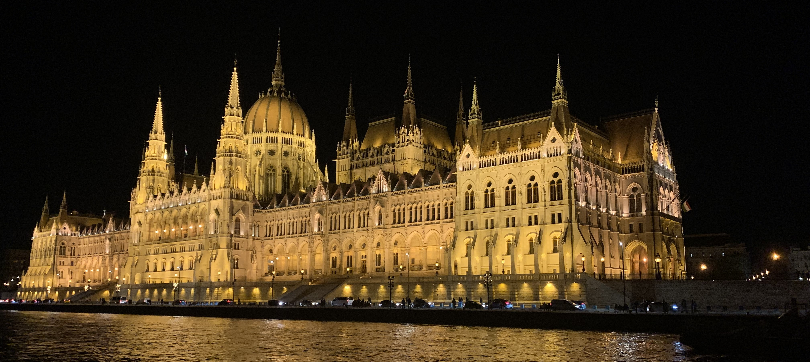

  <ul>
    <li><a href="./index.html">Home</a></li>
    <li><a href="./cv.html">CV</a></li>
    <li><a href="./research.html" class="active">Research</a></li>
    <li><a href="./publications.html">Publications</a></li>
    <li><a href="./teaching.html">Publications</a></li>
  </ul>

# ABOUT ME

Highly motivated and research-driven expert with proficiency in code-based cryptography, seeking to leverage my skills and knowledge to contribute to cybersecurity solutions in the post-quantum era within an industry setting.

I am currently a postdoctoral researcher in the GAE team at IRMAR, University of Rennes.

On September 14, 2020, I completed my Ph.D. in mathematics and computer science at the University of Szeged, under the supervision of Gabor P. Nagy.

My research primarily focuses on error-correcting codes from algebraic geometry and their applications in cryptography.

## WORK EXPERIENCE
- Post-doctoral Researcher in Code-Based Cryptography, University of Rennes1, IRMAR
- Researcher, SZTE TTIK, Bolyai Intitute
- Junior Researcher, SZTE TTIK, Bolyai Institute

## EDUCATION AND TRAINING
- PhD in Mathematics and Computer Science, Bolyai Institute, University of Szeged
- MSc in Mathematics, Cryptology and Computer Security, Ecole Normale Supérieure, University of Hassan II

## WINTER/ SUMMER SCHOOLS AND CONFERENCES
- Journées Codage et Cryptographie (C2) 2023
- Central European Conference on Cryptology 2021, Debrecen, Hungary
- Developments in Computer Science Conference, Budapest, Hungary
- Mini-Workshop Of SETIT IoT Project, Szeged, Hungary University of Szeged, Hungary.
- SUMMER SCHOOL ON FINITE GEOMETRY AND FRIENDS. Vrjie Universiteit Brussel, Doctoral School of Natural Sciences and Engineering.
- Combinatorics Seminar, Szeged, Hungary University of Szeged.

## LANGUAGES
- Arabic: Mother Tongue
- French: Advanced
- English: Advanced
- Italian: Elementary

## DIGITAL SKILLS
- Computation skills
- GAP System
- Java Programming language
- Python programming language and some knowledge in MATLAB
- Data Analysis
- C programming